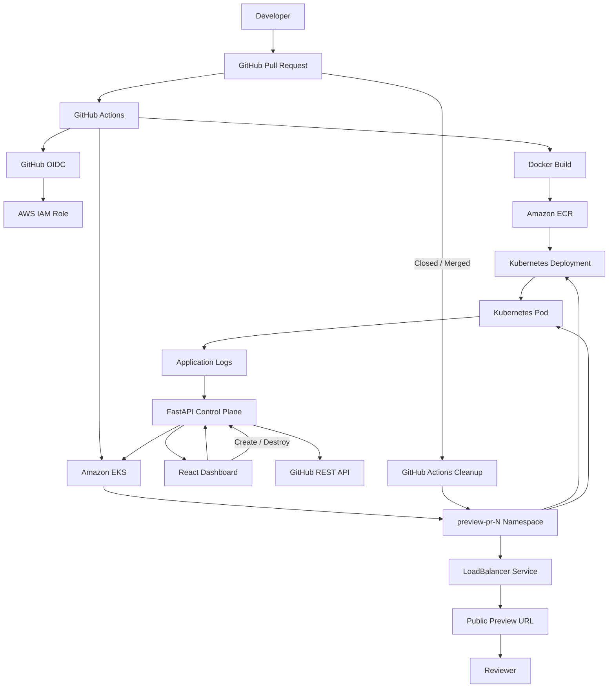

# Cloud Preview Platform

A cloud-native platform for creating, observing, and destroying **ephemeral Kubernetes preview environments** for GitHub pull requests.

The platform combines automated GitHub Actions deployments with an interactive developer dashboard backed by a FastAPI control plane. Each pull request can receive an isolated Kubernetes namespace, PR-specific container image, public AWS Load Balancer endpoint, live deployment status, Kubernetes health information, and application logs.

Preview environments can be created automatically through GitHub Actions or managed interactively from the dashboard.

---

## What It Does

When a pull request is opened or updated, the platform can automatically:

1. Authenticate to AWS using GitHub OIDC
2. Build a PR-specific Docker image
3. Push the image to Amazon ECR
4. Create an isolated Kubernetes namespace
5. Deploy the application to Amazon EKS
6. Create a public LoadBalancer Service
7. Wait for the preview endpoint
8. Post the preview URL to the GitHub pull request

The developer dashboard provides a second control path for managing existing PR images:

- Create preview environments
- Monitor deployment state
- Open live previews
- Inspect Kubernetes resources
- View pod health and restart counts
- Inspect CPU and memory configuration
- Read live pod logs
- Destroy preview environments

---

## Dashboard

The React dashboard acts as a lightweight developer control plane for the preview platform.

It displays live state from Amazon EKS rather than hard-coded environment data.

### Dashboard capabilities

- Active preview count
- Ready / Building / Destroying states
- GitHub pull request metadata
- Branch and author information
- Kubernetes namespace
- Container image tag
- Replica readiness
- Pod state
- Pod restart count
- Deployment conditions
- CPU requests and limits
- Memory requests and limits
- LoadBalancer availability
- Live application logs
- Preview URL
- GitHub PR link
- Preview creation
- Confirmation-protected preview destruction
- Search and filtering
- Automatic cluster polling

---

## Architecture



The platform therefore supports two management paths:

```text
GitHub Pull Request
        |
        v
GitHub Actions
        |
        +--------------------+
                             |
                             v
                    EKS Preview Environment
                             ^
                             |
                    FastAPI Control Plane
                             ^
                             |
                       React Dashboard
```

GitHub Actions provides automated CI/CD-driven previews, while the dashboard provides an interactive developer control plane.

---

## Preview Lifecycle

### 1. Pull Request Created

A developer opens a pull request.

GitHub Actions starts the preview workflow.

```text
Pull Request
     |
     v
GitHub Actions
```

### 2. Container Image Built

Docker Buildx creates a PR-specific image.

Examples:

```text
pr-4
pr-5
pr-12
```

Images are built for:

```text
linux/amd64
```

and pushed to Amazon ECR.

### 3. Namespace Created

Each preview receives an isolated Kubernetes namespace.

Example:

```text
preview-pr-4
```

This isolates the Deployment, Pod, Service, and other preview resources from other pull requests.

### 4. Application Deployed

The PR-specific ECR image is deployed into Amazon EKS.

Example:

```text
cloud-preview-platform:pr-4
```

The Deployment includes:

- Rolling deployment configuration
- Readiness probes
- Liveness probes
- CPU requests and limits
- Memory requests and limits

### 5. Public Endpoint Provisioned

A Kubernetes `LoadBalancer` Service provisions an AWS load balancer.

Once AWS assigns a hostname, the preview becomes publicly accessible.

### 6. Dashboard Discovers the Environment

The FastAPI control plane queries the Kubernetes API and returns the live environment state to the React dashboard.

The dashboard automatically polls the platform API and displays transitions such as:

```text
BUILDING
   |
   v
READY
```

### 7. Environment Observed

From the dashboard, a developer can inspect:

```text
PR metadata
Namespace
Deployment
Replicas
Pod
Container image
CPU / memory configuration
Deployment conditions
LoadBalancer
Application logs
```

### 8. Environment Destroyed

The environment can be removed automatically when the pull request closes or interactively from the dashboard.

Deleting:

```text
preview-pr-4
```

removes the namespaced Kubernetes resources and triggers cleanup of the associated AWS Load Balancer.

---

## Dashboard-Driven Lifecycle

The dashboard can manage the Kubernetes lifecycle of a preview using an existing PR-specific ECR image.

```text
Create Preview
      |
      v
FastAPI Control Plane
      |
      v
Create preview-pr-N
      |
      +----------------+
      |                |
      v                v
Deployment          Service
      |                |
      v                v
     Pod          LoadBalancer
      |                |
      +-------+--------+
              |
              v
            READY
              |
       +------+------+
       |             |
       v             v
  View Logs     Open Preview
       |
       v
Destroy Preview
       |
       v
Namespace Deleted
```

Destructive actions require confirmation in the dashboard.

---

## Live Kubernetes Observability

The platform API communicates with the Kubernetes API to provide live environment information.

For each preview, the dashboard can display:

### Deployment

- Desired replicas
- Available replicas
- Ready replicas
- Deployment conditions
- Deployment progress

### Pods

- Pod name
- Running phase
- Readiness
- Restart count
- Node assignment

### Container Resources

Example:

```text
CPU request:     100m
CPU limit:       500m

Memory request:  128Mi
Memory limit:    256Mi
```

### Service

- Service type
- Cluster IP
- AWS LoadBalancer availability
- Public preview endpoint

---

## Live Pod Logs

The dashboard can retrieve recent application logs directly from the running Kubernetes pod.

The request path is:

```text
React Dashboard
       |
       v
FastAPI
       |
       v
Kubernetes API
       |
       v
Running Pod
       |
       v
Application Logs
```

Example log output:

```text
INFO: 10.0.1.36 - "GET /health HTTP/1.1" 200 OK
```

The browser never receives direct Kubernetes credentials.

---

## Platform API

The control plane is implemented with FastAPI.

Current API capabilities include:

```text
GET    /health
GET    /api/previews
GET    /api/previews/{pr_number}
GET    /api/previews/{pr_number}/logs
POST   /api/previews
DELETE /api/previews/{pr_number}
```

### `GET /api/previews`

Discovers active `preview-pr-*` namespaces and returns summary information.

### `GET /api/previews/{pr_number}`

Returns detailed Kubernetes state for an environment.

### `GET /api/previews/{pr_number}/logs`

Returns recent application logs from the running pod.

### `POST /api/previews`

Creates a Kubernetes preview environment using an existing PR-specific ECR image.

### `DELETE /api/previews/{pr_number}`

Deletes the corresponding preview namespace and its namespaced resources.

---

## Technology Stack

### Cloud

- AWS
- Amazon EKS
- Amazon ECR
- AWS IAM
- Amazon VPC
- Elastic Load Balancing
- AWS NAT Gateway
- AWS KMS

### Infrastructure as Code

- Terraform
- Terraform AWS Provider
- `terraform-aws-modules/eks`
- `terraform-aws-modules/vpc`

### Kubernetes

- Amazon EKS
- Deployments
- Pods
- Services
- Namespaces
- RBAC
- EKS Access Entries
- Managed node groups
- Readiness probes
- Liveness probes
- Resource requests and limits

### CI/CD

- GitHub Actions
- GitHub OIDC
- AWS IAM role assumption
- Docker Buildx

### Backend

- Python
- FastAPI
- Kubernetes Python Client
- GitHub REST API
- Uvicorn

### Frontend

- React
- TypeScript
- Vite

### Containers

- Docker
- Amazon ECR

---

## AWS Infrastructure

The AWS infrastructure is provisioned and managed with Terraform.

### VPC

The networking layer contains:

- VPC
- Public subnets
- Private subnets
- Internet Gateway
- NAT Gateway
- Route tables

EKS worker nodes run in private subnets.

### Amazon EKS

Cluster:

```text
cloud-preview-eks
```

Kubernetes version:

```text
1.34
```

Managed node group instance type:

```text
t3.small
```

Managed EKS add-ons:

- VPC CNI
- CoreDNS
- kube-proxy

### Amazon ECR

Repository:

```text
cloud-preview-platform
```

Preview images use PR-specific tags:

```text
pr-1
pr-2
pr-3
pr-4
```

This allows each preview environment to reference the image associated with its pull request.

---

## GitHub Actions CI/CD

The preview workflow responds to pull request lifecycle events.

For an active pull request, the workflow:

1. Checks out the repository
2. Authenticates to AWS through GitHub OIDC
3. Configures access to Amazon EKS
4. Authenticates to Amazon ECR
5. Builds the Docker image
6. Pushes the PR-specific image
7. Creates the preview namespace
8. Deploys the application
9. Creates the LoadBalancer Service
10. Waits for the public endpoint
11. Posts the preview URL to the pull request

When the pull request is closed or merged, the corresponding preview namespace is deleted.

---

## Passwordless AWS Authentication

GitHub Actions does not require long-lived AWS access keys.

Authentication uses OpenID Connect:

```text
GitHub Actions
      |
      v
GitHub OIDC Token
      |
      v
AWS IAM
      |
      v
cloud-preview-github-actions
```

The IAM role trust relationship restricts role assumption to the configured GitHub repository identity.

---

## EKS Access and Kubernetes RBAC

The GitHub Actions IAM role is registered with the cluster through an EKS access entry.

Preview deployment access is scoped using:

- EKS access policies
- Kubernetes RBAC
- `preview-pr-*` namespace scope
- A dedicated namespace-management Kubernetes group

The CI/CD role does not require unrestricted cluster-administrator access for normal preview deployment operations.

---

## Security Design

### GitHub OIDC

Temporary AWS credentials are issued through OIDC rather than storing permanent AWS access keys in GitHub.

### Dedicated CI/CD IAM Role

GitHub Actions assumes:

```text
cloud-preview-github-actions
```

instead of using a developer IAM identity.

### Repository-Restricted Trust

The IAM role trust relationship is restricted to the intended GitHub repository workflow identity.

### Private Worker Nodes

EKS worker nodes run inside private VPC subnets.

### ECR Image Scanning

Container image scanning is enabled when images are pushed.

### EKS Access Entries

AWS identities are mapped to EKS through access entries.

### Kubernetes RBAC

Namespace management is separated from namespaced application permissions.

### Backend-Mediated Cluster Access

The React application does not communicate directly with Kubernetes.

```text
Browser
   |
   v
FastAPI
   |
   v
Kubernetes API
```

This prevents Kubernetes credentials from being exposed to the browser.

### Confirmation-Protected Destruction

The dashboard requires explicit confirmation before deleting a preview environment.

---

## Application

The preview application is implemented with FastAPI.

The container runs:

```text
uvicorn main:app --host 0.0.0.0 --port 8000
```

The application listens internally on port:

```text
8000
```

The LoadBalancer exposes it publicly on:

```text
80
```

A successfully deployed preview returns:

```json
{
  "message": "Preview Environment Platform",
  "version": "1.1.0"
}
```

The application also provides a health endpoint used by Kubernetes readiness and liveness probes.

---

## Project Structure

```text
cloud-preview-platform/
|
├── .github/
│   └── workflows/
│       └── preview.yml
|
├── api/
│   ├── main.py
│   └── requirements.txt
|
├── app/
│   ├── main.py
│   └── requirements.txt
|
├── docs/
│   └── architecture.png
|
├── frontend/
│   ├── public/
│   ├── src/
│   │   ├── App.tsx
│   │   ├── App.css
│   │   ├── index.css
│   │   └── main.tsx
│   ├── package.json
│   └── vite.config.ts
|
├── terraform/
│   ├── main.tf
│   ├── vpc.tf
│   ├── eks.tf
│   ├── rbac.tf
│   └── .terraform.lock.hcl
|
├── Dockerfile
├── .gitignore
└── README.md
```

Kubernetes preview resources are generated dynamically rather than stored as static manifests.

---

## Running the Preview Application Locally

Create a virtual environment:

```bash
python3 -m venv .venv
```

Activate it:

```bash
source .venv/bin/activate
```

Install dependencies:

```bash
pip install -r app/requirements.txt
```

Run the application:

```bash
uvicorn app.main:app --reload --host 0.0.0.0 --port 8000
```

---

## Running the Platform API Locally

Install the control-plane dependencies:

```bash
python3 -m pip install -r api/requirements.txt
```

Ensure your local kubeconfig can access:

```text
cloud-preview-eks
```

Then start the API:

```bash
python3 -m uvicorn api.main:app --reload --port 8000
```

Verify:

```bash
curl http://127.0.0.1:8000/health
```

Expected response:

```json
{
  "status": "healthy"
}
```

---

## Running the Dashboard Locally

In another terminal:

```bash
cd frontend
npm install
npm run dev
```

Open:

```text
http://localhost:5173
```

The dashboard connects to the local FastAPI control plane on:

```text
http://127.0.0.1:8000
```

---

## Running with Docker

Build the preview application:

```bash
docker build -t cloud-preview-platform .
```

Run it:

```bash
docker run -p 8000:8000 cloud-preview-platform
```

---

## Terraform

Infrastructure configuration is located in:

```text
terraform/
```

Initialize:

```bash
cd terraform
terraform init
```

Format:

```bash
terraform fmt
```

Validate:

```bash
terraform validate
```

Review changes:

```bash
terraform plan
```

Apply:

```bash
terraform apply
```

Terraform state files must not be committed to the repository.

---

## End-to-End Validation

The platform has been tested through the complete lifecycle.

### GitHub-Driven Flow

```text
Pull Request Opened
        |
        v
GitHub Actions
        |
        v
OIDC Authentication
        |
        v
Docker Image Built
        |
        v
Image Pushed to ECR
        |
        v
EKS Namespace Created
        |
        v
Application Deployed
        |
        v
AWS Load Balancer Created
        |
        v
Preview URL Available
        |
        v
Pull Request Closed / Merged
        |
        v
Namespace Deleted
```

### Dashboard-Driven Flow

```text
Create Preview
      |
      v
BUILDING
      |
      v
READY
      |
      +-------------------+
      |                   |
      v                   v
Open Preview         View Details
                          |
                          v
                     View Logs
                          |
                          v
                   Destroy Preview
                          |
                          v
                     0 Active
```

This validates provisioning, observability, application access, and cleanup.

---

## Engineering Tradeoffs

### One Load Balancer Per Preview

Each preview currently receives its own Kubernetes `LoadBalancer` Service.

Advantages:

- Simple isolation
- Independent preview URLs
- Straightforward lifecycle management

Tradeoff:

- Higher cost and slower provisioning at large scale

A larger implementation could use a shared Application Load Balancer with an ingress controller.

### Existing ECR Image Required for Dashboard Creation

The dashboard control plane creates Kubernetes environments from existing `pr-N` images.

Image building remains the responsibility of CI/CD.

This keeps responsibilities separated:

```text
GitHub Actions
    |
    v
Build + Push Image

Dashboard
    |
    v
Manage Kubernetes Lifecycle
```

### Public Preview Endpoints

Preview environments currently use public HTTP LoadBalancer endpoints.

A production implementation should add:

- HTTPS/TLS
- Authentication
- Custom preview domains
- Network restrictions where appropriate

### Local Control Plane

The current dashboard/API control plane is intended for local development and demonstration.

Before exposing create/delete operations publicly, the API should be protected with authentication and authorization.

---

## Future Improvements

Potential production-scale improvements include:

- Authentication for the developer dashboard
- Role-based dashboard authorization
- HTTPS/TLS
- Custom preview domains
- Shared ingress architecture
- Preview expiration / TTL policies
- Cost controls
- Metrics and tracing
- Centralized log aggregation
- Persistent deployment history
- Audit logging
- Multiple application support
- WebSocket or server-sent-event updates
- GitHub webhook integration
- Automated ECR image cleanup

---

## Skills Demonstrated

This project demonstrates hands-on experience with:

- AWS cloud infrastructure
- Amazon EKS
- Amazon ECR
- Kubernetes
- Terraform
- Infrastructure as Code
- Docker
- GitHub Actions
- CI/CD pipelines
- GitHub OIDC
- AWS IAM
- Kubernetes RBAC
- EKS Access Entries
- VPC networking
- React
- TypeScript
- FastAPI
- REST API design
- Kubernetes API integration
- Container health checks
- Resource management
- Live application logging
- Ephemeral environments
- Developer platform engineering
- Automated environment lifecycle management
- Cloud security fundamentals

---

## Status

### Platform Foundation

- [x] Dockerized FastAPI application
- [x] Terraform-managed AWS infrastructure
- [x] Amazon ECR
- [x] Amazon EKS
- [x] Private EKS worker nodes
- [x] GitHub Actions CI/CD
- [x] GitHub OIDC authentication
- [x] PR-specific images
- [x] PR-specific namespaces
- [x] Automatic preview deployment
- [x] Public preview URLs
- [x] Automatic cleanup

### Security and Reliability

- [x] Kubernetes readiness probes
- [x] Kubernetes liveness probes
- [x] CPU requests and limits
- [x] Memory requests and limits
- [x] Rolling deployment configuration
- [x] EKS access entries
- [x] Namespace-scoped EKS deployment access
- [x] Kubernetes namespace-management RBAC

### Developer Control Plane

- [x] React + TypeScript dashboard
- [x] FastAPI platform API
- [x] Live EKS environment discovery
- [x] GitHub PR metadata
- [x] Deployment status
- [x] Pod status
- [x] Resource configuration
- [x] Deployment conditions
- [x] Live pod logs
- [x] Create preview
- [x] Destroy preview
- [x] Open live preview
- [x] Search and filtering
- [x] Automatic dashboard polling

### Future Production Enhancements

- [ ] Dashboard authentication
- [ ] HTTPS/TLS
- [ ] Shared ingress
- [ ] Custom preview domains
- [ ] Persistent deployment history
- [ ] Monitoring and tracing
- [ ] Preview TTL / expiration
- [ ] Cost controls

---

## Author

**Monish Gandhe**

Cloud / DevOps / Software Engineering Project