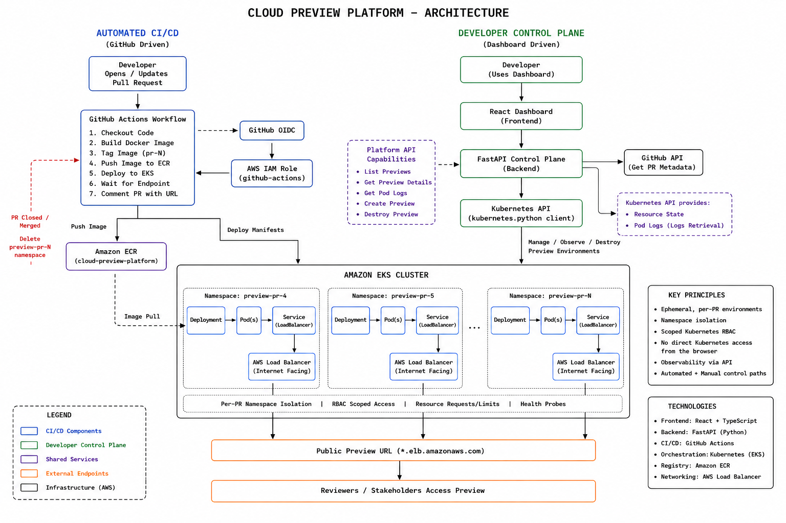

# Cloud Preview Platform

An automated platform for creating **ephemeral preview environments for GitHub pull requests** using AWS, Kubernetes, Terraform, Docker, and GitHub Actions.

When a pull request is opened or updated, the platform automatically:

- Builds a PR-specific Docker image
- Pushes the image to Amazon ECR
- Creates an isolated Kubernetes namespace in Amazon EKS
- Deploys a production-hardened application
- Provisions a dedicated AWS Load Balancer
- Posts the live preview URL directly to the GitHub pull request

When the pull request is closed or merged, the preview environment is automatically deleted.

---

## Architecture



---

## Why I Built This

Reviewing application changes is easier when developers can interact with a running version of the code before it is merged.

Without preview environments, teams may need to run changes locally, share screenshots, manually deploy branches, or coordinate access to a shared staging environment.

This project automates that process.

```text
Developer opens PR
        |
        v
GitHub Actions
        |
        v
Build + Deploy
        |
        v
Isolated Preview Environment
        |
        v
Live Preview URL
        |
        v
Review changes
        |
        v
Merge / Close PR
        |
        v
Automatic Cleanup
```

Each environment exists only for the lifetime of its pull request.

---

## How It Works

### 1. Pull Request Opened

The workflow responds to the following GitHub pull request events:

```yaml
pull_request:
  types:
    - opened
    - synchronize
    - reopened
    - closed
```

Opening or updating a pull request starts the preview deployment workflow.

---

### 2. Secure AWS Authentication

GitHub Actions authenticates to AWS using **OpenID Connect (OIDC)**.

```text
GitHub Actions
      |
      v
GitHub OIDC Token
      |
      v
AWS IAM
      |
      v
cloud-preview-github-actions
```

No long-lived AWS access keys are stored in GitHub.

The IAM trust relationship is restricted to the repository's pull-request identity.

---

### 3. Docker Image Built

GitHub Actions builds the application using Docker Buildx.

Each pull request receives its own image tag:

```text
PR #1  -> pr-1
PR #2  -> pr-2
PR #15 -> pr-15
```

Images are built for:

```text
linux/amd64
```

and pushed to Amazon ECR.

---

### 4. Image Stored in Amazon ECR

The ECR repository is:

```text
cloud-preview-platform
```

Preview images use PR-specific tags:

```text
pr-1
pr-2
pr-3
...
pr-N
```

ECR image scanning is enabled on push.

---

### 5. Isolated Kubernetes Namespace Created

Each pull request receives its own Kubernetes namespace.

Example:

```text
preview-pr-15
```

This provides isolation between preview environments.

Multiple pull requests can therefore exist independently:

```text
Amazon EKS
│
├── preview-pr-12
│   ├── Deployment
│   └── LoadBalancer Service
│
├── preview-pr-13
│   ├── Deployment
│   └── LoadBalancer Service
│
└── preview-pr-14
    ├── Deployment
    └── LoadBalancer Service
```

---

### 6. Application Deployed

The workflow dynamically creates the Kubernetes Deployment and Service for the pull request.

The Deployment references the corresponding ECR image:

```text
cloud-preview-platform:pr-15
```

Kubernetes manifests for preview environments are generated by the CI/CD workflow rather than maintained as static per-PR files.

---

### 7. Kubernetes Health Checks

Preview deployments use both readiness and liveness probes against:

```text
GET /health
```

The FastAPI application responds with:

```json
{
  "status": "healthy"
}
```

The readiness probe prevents Kubernetes from routing traffic to the application until it is ready.

The liveness probe allows Kubernetes to restart an unhealthy application container automatically.

---

### 8. Resource Management

Each preview container has explicit resource requests and limits.

```yaml
resources:
  requests:
    cpu: 100m
    memory: 128Mi
  limits:
    cpu: 500m
    memory: 256Mi
```

This prevents an individual preview environment from consuming unlimited worker-node resources.

---

### 9. Safer Rolling Updates

Deployments use a rolling update strategy:

```yaml
strategy:
  type: RollingUpdate
  rollingUpdate:
    maxUnavailable: 0
    maxSurge: 1
```

This allows an updated preview to become available before the previous pod is removed.

---

### 10. Dedicated Preview Load Balancer

Each preview namespace contains a Kubernetes Service with:

```yaml
type: LoadBalancer
```

That Service provisions a dedicated AWS Load Balancer for the preview.

The architecture is therefore:

```text
preview-pr-1
    |
    v
LoadBalancer #1
    |
    v
Preview URL #1


preview-pr-2
    |
    v
LoadBalancer #2
    |
    v
Preview URL #2
```

Each active pull request receives a unique endpoint.

---

### 11. Preview URL Posted to GitHub

GitHub Actions waits for AWS to assign the Load Balancer hostname.

Once available, the workflow automatically posts the URL to the pull request.

Example:

```text
Preview Environment

Your preview environment is ready:
http://example.us-west-2.elb.amazonaws.com

Namespace: preview-pr-15
Image: pr-15
```

Reviewers can open the URL and test the exact code contained in the pull request.

---

### 12. Automatic Cleanup

Closing or merging the pull request triggers the cleanup path.

```text
PR Closed / Merged
        |
        v
GitHub Actions
        |
        v
Delete preview-pr-N
        |
        v
Deployment Deleted
Service Deleted
Pods Deleted
        |
        v
AWS Load Balancer Removed
```

This prevents abandoned preview environments from remaining in the Kubernetes cluster.

---

## End-to-End Flow

```text
Developer
    |
    v
GitHub Pull Request
    |
    v
GitHub Actions
    |
    +----------------------+
    |                      |
    v                      v
GitHub OIDC           Docker Build
    |                      |
    v                      v
AWS IAM Role           Amazon ECR
    |                      |
    +----------+-----------+
               |
               v
           Amazon EKS
               |
               v
         preview-pr-N
               |
        +------+------+
        |             |
        v             v
   Deployment    LoadBalancer
        |             |
        +------+------+
               |
               v
        Unique Preview URL
               |
               v
       GitHub PR Comment
               |
               v
            Reviewer


PR Closed / Merged
        |
        v
Delete preview-pr-N
        |
        v
Environment Removed
```

---

## Technology Stack

### Cloud

- AWS
- Amazon EKS
- Amazon ECR
- AWS IAM
- Amazon VPC
- AWS Elastic Load Balancing
- AWS NAT Gateway
- AWS KMS

### Infrastructure as Code

- Terraform
- Terraform AWS Provider
- Terraform Kubernetes Provider
- terraform-aws-modules/eks
- terraform-aws-modules/vpc

### Kubernetes

- Amazon EKS
- Namespaces
- Deployments
- Services
- RBAC
- Readiness probes
- Liveness probes
- Resource requests and limits
- Rolling updates
- Managed node groups

### Containers

- Docker
- Docker Buildx

### CI/CD

- GitHub Actions
- GitHub OIDC
- AWS IAM role assumption

### Application

- Python
- FastAPI
- Uvicorn

---

## AWS Infrastructure

The AWS infrastructure is provisioned and managed with Terraform.

### VPC

The networking layer includes:

- VPC
- Public subnets
- Private subnets
- Internet Gateway
- NAT Gateway
- Route tables

EKS worker nodes run in private subnets.

---

## Amazon EKS

The Kubernetes cluster is:

```text
cloud-preview-eks
```

The current Kubernetes version is:

```text
1.34
```

The managed node group uses:

```text
t3.small
```

with autoscaling configuration:

```text
Minimum: 1
Desired: 1
Maximum: 2
```

The cluster uses managed EKS add-ons:

- VPC CNI
- CoreDNS
- kube-proxy

---

## Amazon ECR

Application images are stored in:

```text
cloud-preview-platform
```

Preview images use PR-specific tags:

```text
pr-1
pr-2
pr-3
...
pr-N
```

This ensures each preview environment references the image generated for its pull request.

Image scanning is enabled when images are pushed.

---

## CI/CD Pipeline

The preview workflow is located at:

```text
.github/workflows/preview.yml
```

For an active pull request, the workflow:

1. Checks out the repository
2. Authenticates to AWS through GitHub OIDC
3. Configures kubectl for Amazon EKS
4. Logs into Amazon ECR
5. Builds the Docker image
6. Pushes the PR-specific image
7. Verifies the ECR image
8. Ensures the PR namespace exists
9. Deploys the application
10. Configures readiness and liveness probes
11. Applies CPU and memory limits
12. Waits for the Kubernetes Deployment
13. Verifies application health
14. Waits for the AWS Load Balancer
15. Posts the preview URL to the pull request

For a closed pull request, the workflow:

1. Authenticates to AWS
2. Connects to Amazon EKS
3. Deletes the PR namespace

---

## Security

Security was treated as a first-class part of the platform rather than relying on permanent cloud credentials or cluster-admin CI/CD access.

### GitHub OIDC

GitHub Actions authenticates to AWS using temporary OIDC credentials.

No long-lived AWS access keys are required in GitHub secrets.

---

### Dedicated CI/CD IAM Role

GitHub Actions assumes:

```text
cloud-preview-github-actions
```

The workflow does not use the developer IAM identity.

---

### Repository-Restricted OIDC Trust

The AWS IAM trust policy restricts role assumption to the GitHub repository's pull-request identity.

The OIDC audience is restricted to:

```text
sts.amazonaws.com
```

---

### Scoped ECR Permissions

The GitHub Actions IAM role receives only the ECR permissions required to authenticate, push images, verify images, and interact with the project's ECR repository.

---

### Restricted EKS Access

GitHub Actions does **not** have EKS cluster-admin access.

The IAM role is registered with EKS using an EKS access entry.

Application-level access uses:

```text
AmazonEKSEditPolicy
```

scoped to namespaces matching:

```text
preview-pr-*
```

This prevents the CI/CD role from receiving edit access across every Kubernetes namespace.

---

### Namespace Lifecycle RBAC

Because Kubernetes namespace creation and deletion are cluster-scoped operations, a dedicated Kubernetes RBAC role handles only preview namespace lifecycle management.

Terraform manages:

```text
preview-namespace-manager
```

The role is limited to namespace operations required by the preview workflow.

It does not grant the workflow general cluster administration.

---

### Private Worker Nodes

EKS worker nodes are deployed inside private VPC subnets.

Outbound internet access is provided through NAT rather than directly exposing worker nodes publicly.

---

### ECR Image Scanning

Amazon ECR scans container images when they are pushed.

---

## Production Hardening

The preview deployment includes several production-oriented safeguards.

### Readiness Probe

```text
/health
```

is checked before Kubernetes sends traffic to the application.

### Liveness Probe

Kubernetes continuously checks application health and can restart unhealthy containers.

### CPU Limits

```text
Request: 100m
Limit:   500m
```

### Memory Limits

```text
Request: 128Mi
Limit:   256Mi
```

### Rolling Updates

```text
maxUnavailable: 0
maxSurge: 1
```

### Image Pull Behavior

Preview containers use:

```text
imagePullPolicy: Always
```

so updated PR images are retrieved during deployment.

---

## Project Structure

```text
cloud-preview-platform/
│
├── .github/
│   └── workflows/
│       └── preview.yml
│
├── app/
│   ├── main.py
│   └── requirements.txt
│
├── docs/
│   └── architecture.png
│
├── terraform/
│   ├── main.tf
│   ├── vpc.tf
│   ├── eks.tf
│   ├── rbac.tf
│   └── .terraform.lock.hcl
│
├── Dockerfile
├── README.md
└── .gitignore
```

Preview Kubernetes resources are generated dynamically by the GitHub Actions workflow.

---

## Running Locally

Create a Python virtual environment:

```bash
python3 -m venv .venv
```

Activate it:

```bash
source .venv/bin/activate
```

Install dependencies:

```bash
pip install -r app/requirements.txt
```

Run the application:

```bash
uvicorn app.main:app --reload --host 0.0.0.0 --port 8000
```

Open:

```text
http://localhost:8000
```

Health endpoint:

```text
http://localhost:8000/health
```

---

## Running with Docker

Build the image:

```bash
docker build -t cloud-preview-platform .
```

Run the container:

```bash
docker run -p 8000:8000 cloud-preview-platform
```

Open:

```text
http://localhost:8000
```

---

## Terraform

Infrastructure configuration is located in:

```text
terraform/
```

Initialize Terraform:

```bash
cd terraform
terraform init
```

Validate:

```bash
terraform validate
```

Review changes:

```bash
terraform plan
```

Apply changes:

```bash
terraform apply
```

Terraform state files are excluded from Git and should not be committed.

---

## Tested End-to-End

The platform has been tested through multiple complete pull-request lifecycles.

The validated flow includes:

```text
Pull Request Opened
        |
        v
GitHub Actions Started
        |
        v
OIDC Authentication
        |
        v
Docker Image Built
        |
        v
Image Pushed to ECR
        |
        v
Preview Namespace Created
        |
        v
Hardened Deployment Created
        |
        v
Health Checks Pass
        |
        v
AWS Load Balancer Created
        |
        v
Preview URL Posted to GitHub
        |
        v
Application Successfully Accessed
        |
        v
Pull Request Merged
        |
        v
Preview Namespace Deleted
        |
        v
Environment Cleaned Up
```

The deployed preview returned:

```json
{
  "message": "Preview Environment Platform",
  "version": "1.1.0"
}
```

The same lifecycle was also verified after removing EKS cluster-admin access from the GitHub Actions role.

---

## Architecture Tradeoffs

### One Load Balancer Per Preview

Each preview currently receives its own AWS Load Balancer.

This provides simple isolation and unique endpoints but becomes less cost-efficient as the number of simultaneous previews grows.

A future version can use a shared ingress architecture.

---

### Dynamic Kubernetes Resources

Preview Deployments and Services are generated directly by the CI/CD workflow.

This keeps the current system simple, but a larger implementation could move these resources into reusable Helm charts.

---

### Public EKS API Endpoint

The EKS API currently has public endpoint access enabled to allow GitHub-hosted Actions runners to connect to the cluster.

A more restrictive production architecture could use private runners or additional network controls.

---

## Roadmap

### Phase 1 — Platform Foundation

- [x] Dockerized FastAPI application
- [x] Terraform-managed AWS infrastructure
- [x] Amazon VPC
- [x] Amazon ECR
- [x] Amazon EKS
- [x] Managed node group
- [x] EKS managed add-ons
- [x] GitHub Actions CI/CD
- [x] GitHub OIDC authentication
- [x] PR-specific Docker images
- [x] PR-specific Kubernetes namespaces
- [x] Automatic preview deployments
- [x] Unique preview URLs
- [x] GitHub PR comments
- [x] Automatic cleanup

### Phase 2 — Production & Security Hardening

- [x] Kubernetes readiness probes
- [x] Kubernetes liveness probes
- [x] CPU requests and limits
- [x] Memory requests and limits
- [x] Rolling deployment strategy
- [x] PR-specific deployment labels
- [x] Remove CI/CD EKS cluster-admin access
- [x] Namespace-scoped EKS edit permissions
- [x] Dedicated namespace-management RBAC
- [x] Terraform-managed Kubernetes RBAC

### Phase 3 — Platform Improvements

- [ ] Shared ingress architecture
- [ ] HTTPS/TLS
- [ ] Custom preview domains
- [ ] Automatic preview expiration
- [ ] Monitoring and observability
- [ ] Centralized logs
- [ ] Cost controls
- [ ] Improved deployment status reporting

### Phase 4 — Preview Platform Dashboard

The next major feature is a web dashboard for viewing and managing preview environments.

Planned dashboard features:

- [ ] Active preview environments
- [ ] Pull request information
- [ ] Deployment status
- [ ] Kubernetes namespace
- [ ] Container image version
- [ ] Preview URL
- [ ] Environment age
- [ ] Deployment history
- [ ] Open Preview action
- [ ] View Logs
- [ ] Redeploy environment
- [ ] Destroy environment

Example:

```text
Cloud Preview Platform
────────────────────────────────────

3 Active Previews

┌──────────────────────────────────┐
│ PR #15                 ● RUNNING │
│                                  │
│ Namespace: preview-pr-15         │
│ Image:     pr-15                 │
│                                  │
│ [ Open Preview ]                 │
└──────────────────────────────────┘

┌──────────────────────────────────┐
│ PR #16                ● BUILDING │
│                                  │
│ Namespace: preview-pr-16         │
└──────────────────────────────────┘
```

---

## Skills Demonstrated

This project demonstrates hands-on experience with:

- AWS cloud infrastructure
- Amazon EKS
- Amazon ECR
- Amazon VPC
- AWS IAM
- Kubernetes
- Kubernetes RBAC
- Terraform
- Infrastructure as Code
- Docker
- GitHub Actions
- CI/CD pipelines
- GitHub OIDC
- Container security
- VPC networking
- Ephemeral environments
- Automated environment lifecycle management
- Resource management
- Production deployment patterns
- Cloud security fundamentals

---

## Author

**Monish Gandhe**

Cloud / DevOps / Software Engineering Project