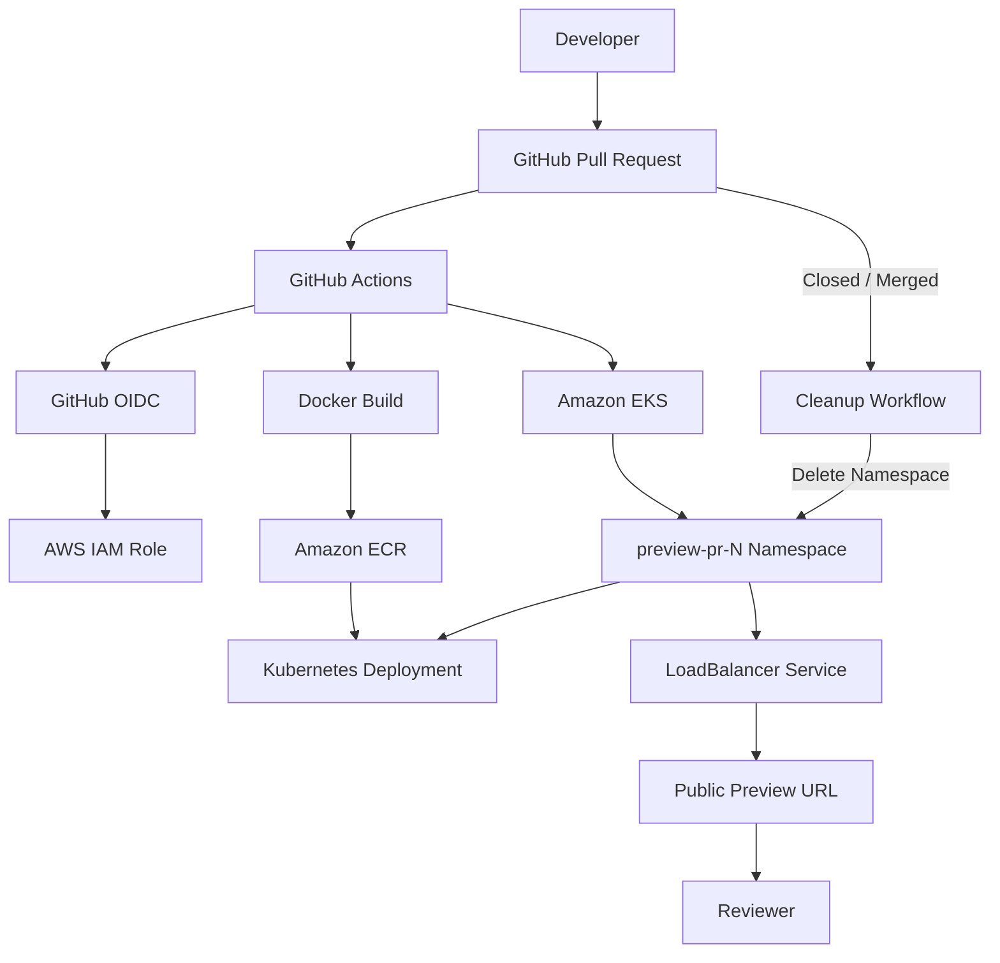

# Cloud Preview Platform

An automated platform for creating **ephemeral preview environments for GitHub pull requests** using AWS, Kubernetes, Terraform, Docker, and GitHub Actions.

When a pull request is opened or updated, the platform automatically builds a PR-specific Docker image, pushes it to Amazon ECR, deploys the application into an isolated Amazon EKS namespace, provisions a public preview endpoint, and posts the preview URL directly to the pull request.

When the pull request is closed or merged, the preview environment is automatically removed.

---

## Why I Built This

Reviewing application changes is easier when developers can interact with a running version of the code before it is merged.

Without preview environments, teams may need to:

- Run changes locally
- Share screenshots
- Deploy manually
- Use a shared staging environment
- Coordinate deployments between developers

This project automates that process.

Each pull request receives its own temporary environment:

```text
Pull Request
     |
     v
Docker Image
     |
     v
Isolated Kubernetes Environment
     |
     v
Live Preview URL
```

The environment exists only for the lifetime of the pull request.

---

## Architecture



---

## Preview Environment Lifecycle

### 1. Pull Request Opened

A developer opens a pull request.

GitHub Actions automatically starts the preview workflow.

```text
PR #12
   |
   v
GitHub Actions
```

### 2. Docker Image Built

The application is containerized using Docker Buildx.

Each pull request receives its own image tag.

For example:

```text
pr-1
pr-2
pr-12
```

The image is built for:

```text
linux/amd64
```

and pushed to Amazon ECR.

---

### 3. Preview Namespace Created

The workflow connects to Amazon EKS and creates a namespace specifically for the pull request.

Example:

```text
preview-pr-12
```

This isolates preview resources from other pull requests.

---

### 4. Application Deployed

The workflow creates a Kubernetes Deployment using the PR-specific image:

```text
cloud-preview-platform:pr-12
```

A Kubernetes Service exposes the application through an AWS Load Balancer.

---

### 5. Preview URL Created

GitHub Actions waits for AWS to assign the Load Balancer hostname.

Once available, the workflow posts the preview URL directly to the pull request.

Example:

```text
Preview Environment

Your preview environment is ready:

http://example.us-west-2.elb.amazonaws.com

Namespace: preview-pr-12
Image: pr-12
```

Reviewers can then open the URL and test the application before the pull request is merged.

---

### 6. Pull Request Updated

When new commits are pushed to the pull request, GitHub Actions runs again.

The platform:

```text
Rebuilds image
      |
      v
Pushes updated PR image
      |
      v
Updates preview environment
```

---

### 7. Pull Request Closed or Merged

Closing or merging the pull request triggers the cleanup workflow.

The corresponding Kubernetes namespace is deleted:

```text
preview-pr-12
```

Deleting the namespace removes the preview Kubernetes resources and initiates cleanup of the associated Load Balancer.

---

## End-to-End Workflow

```text
Developer opens PR
        |
        v
GitHub Actions
        |
        v
GitHub OIDC
        |
        v
AWS IAM Role
        |
        +-------------------+
        |                   |
        v                   v
   Docker Build         Amazon EKS
        |                   |
        v                   v
   Amazon ECR        preview-pr-N
        |                   |
        +-------> Deployment
                            |
                            v
                       LoadBalancer
                            |
                            v
                       Preview URL
                            |
                            v
                    GitHub PR Comment


PR Closed / Merged
        |
        v
GitHub Actions
        |
        v
Delete preview-pr-N
        |
        v
Environment Cleaned Up
```

---

## Technology Stack

### Cloud

- AWS
- Amazon EKS
- Amazon ECR
- AWS IAM
- Amazon VPC
- AWS Load Balancing
- AWS NAT Gateway
- AWS KMS

### Infrastructure as Code

- Terraform
- Terraform AWS Provider
- terraform-aws-modules/eks
- terraform-aws-modules/vpc

### Containers

- Docker
- Docker Buildx

### Kubernetes

- Amazon EKS
- Deployments
- Services
- Namespaces
- Managed node groups

### CI/CD

- GitHub Actions
- GitHub OIDC
- AWS IAM role assumption

### Application

- Python
- FastAPI
- Uvicorn

---

## AWS Infrastructure

The AWS infrastructure is managed using Terraform.

### VPC

The networking layer contains:

- VPC
- Public subnets
- Private subnets
- Internet Gateway
- NAT Gateway
- Route tables

EKS worker nodes are deployed into private subnets.

---

## Amazon EKS

The Kubernetes cluster is named:

```text
cloud-preview-eks
```

The project currently uses Kubernetes:

```text
1.34
```

The EKS managed node group uses:

```text
t3.small
```

The cluster includes the following managed EKS add-ons:

- VPC CNI
- CoreDNS
- kube-proxy

---

## Amazon ECR

Docker images are stored in the ECR repository:

```text
cloud-preview-platform
```

The normal application image can use:

```text
latest
```

Preview images use PR-specific tags:

```text
pr-1
pr-2
pr-3
```

This ensures each preview environment can reference the image created for its pull request.

ECR image scanning is enabled on push.

---

## GitHub Actions CI/CD

The preview workflow is located at:

```text
.github/workflows/preview.yml
```

It responds to pull request events:

```yaml
pull_request:
  types:
    - opened
    - synchronize
    - reopened
    - closed
```

For an active pull request, the workflow:

1. Checks out the repository
2. Authenticates to AWS
3. Configures kubectl for Amazon EKS
4. Logs into Amazon ECR
5. Builds the Docker image
6. Pushes the PR-specific image to ECR
7. Verifies the image
8. Creates the preview namespace
9. Deploys the application
10. Creates a LoadBalancer Service
11. Waits for the public endpoint
12. Posts the preview URL to the GitHub pull request

When the pull request closes, the workflow deletes the corresponding preview namespace.

---

## Passwordless AWS Authentication

The CI/CD pipeline does **not require long-lived AWS access keys stored in GitHub**.

GitHub Actions authenticates to AWS using OpenID Connect (OIDC):

```text
GitHub Actions
      |
      v
GitHub OIDC Token
      |
      v
AWS IAM
      |
      v
cloud-preview-github-actions
```

The AWS IAM role trust policy restricts role assumption to the GitHub repository's pull-request identity.

---

## EKS Authentication

The GitHub Actions IAM role is registered with the EKS cluster using an EKS access entry.

This allows the CI/CD workflow to authenticate to Kubernetes after assuming its AWS IAM role.

The current implementation uses broad EKS permissions while the platform is being developed.

Reducing these permissions to a least-privilege deployment model is part of the security-hardening roadmap.

---

## Application

The preview application is built with FastAPI.

The container runs:

```text
uvicorn main:app --host 0.0.0.0 --port 8000
```

The application listens internally on:

```text
8000
```

A Kubernetes LoadBalancer Service exposes the preview publicly on port:

```text
80
```

During end-to-end testing, the deployed preview returned:

```json
{
  "message": "Preview Environment Platform",
  "version": "1.1.0"
}
```

---

## Project Structure

```text
cloud-preview-platform/
│
├── .github/
│   └── workflows/
│       └── preview.yml
│
├── app/
│   ├── main.py
│   └── requirements.txt
│
├── k8s/
│   ├── app.yaml
│   ├── deployment.yaml
│   └── service.yaml
│
├── terraform/
│   ├── main.tf
│   ├── vpc.tf
│   ├── eks.tf
│   └── .terraform.lock.hcl
│
├── Dockerfile
├── .gitignore
└── README.md
```

---

## Running Locally

Create a virtual environment:

```bash
python3 -m venv .venv
```

Activate it:

```bash
source .venv/bin/activate
```

Install the application dependencies:

```bash
pip install -r app/requirements.txt
```

Run the FastAPI application:

```bash
uvicorn app.main:app --reload --host 0.0.0.0 --port 8000
```

Open:

```text
http://localhost:8000
```

---

## Running with Docker

Build the container:

```bash
docker build -t cloud-preview-platform .
```

Run it:

```bash
docker run -p 8000:8000 cloud-preview-platform
```

Open:

```text
http://localhost:8000
```

---

## Terraform

Infrastructure configuration is located in:

```text
terraform/
```

Initialize Terraform:

```bash
cd terraform
terraform init
```

Validate the configuration:

```bash
terraform validate
```

Review infrastructure changes:

```bash
terraform plan
```

Apply infrastructure changes:

```bash
terraform apply
```

> Terraform state files should never be committed to the repository.

---

## Security Features

The project currently includes:

### GitHub OIDC

GitHub Actions uses temporary AWS credentials through OIDC rather than permanent AWS access keys.

### Dedicated CI/CD IAM Role

GitHub Actions assumes:

```text
cloud-preview-github-actions
```

instead of using a developer IAM identity.

### Repository-Restricted Trust Policy

The IAM role's OIDC trust relationship is restricted to this repository's pull-request workflow identity.

### Private EKS Worker Nodes

Worker nodes run inside private VPC subnets.

### ECR Image Scanning

Container image scanning is enabled when images are pushed to ECR.

### EKS Access Entries

AWS IAM access to Kubernetes is managed through EKS access entries.

---

## Current Architecture Tradeoffs

The current implementation intentionally prioritizes a simple and demonstrable preview-environment architecture.

### One Load Balancer per Preview

Each pull request currently creates its own LoadBalancer Service.

This makes preview environments simple and isolated, but creating a Load Balancer for every PR would become expensive at larger scale.

A future architecture could use a shared Application Load Balancer or Kubernetes ingress controller.

### Kubernetes Resources Generated by CI/CD

The preview workflow currently generates the PR Deployment and Service dynamically.

A future version could use reusable Helm charts or templated Kubernetes manifests.

### EKS Permissions

The CI/CD role currently has broad Kubernetes access.

This will be replaced with a least-privilege deployment model as part of security hardening.

---

## Production Hardening Roadmap

Planned improvements include:

- Readiness probes
- Liveness probes
- CPU requests and limits
- Memory requests and limits
- Safer rolling deployments
- Least-privilege Kubernetes permissions
- Shared ingress
- HTTPS/TLS
- Custom preview domains
- Preview expiration
- Improved cleanup handling
- Monitoring and observability
- Deployment status reporting
- Cost controls

---

## Preview Dashboard — Planned

The next major feature is a web dashboard for managing and observing preview environments.

Example:

```text
Cloud Preview Platform
────────────────────────────────────

Active Previews: 3

PR #12
● RUNNING
Namespace: preview-pr-12
Image: pr-12
[ Open Preview ]

PR #11
● BUILDING
Namespace: preview-pr-11

PR #10
✓ DESTROYED
```

The dashboard will provide a visual interface for the preview platform and eventually display:

- Active preview environments
- Pull request numbers
- Deployment status
- Kubernetes namespaces
- Container image versions
- Preview URLs
- Environment creation times
- Deployment history

Potential future controls include:

- Open Preview
- Redeploy
- Destroy Environment
- View Logs

---

## Tested End-to-End

The complete preview lifecycle has been tested successfully:

```text
Pull Request Opened
        |
        v
GitHub Actions Started
        |
        v
Docker Image Built
        |
        v
Image Pushed to ECR
        |
        v
EKS Namespace Created
        |
        v
Application Deployed
        |
        v
AWS Load Balancer Created
        |
        v
Preview URL Posted to GitHub
        |
        v
Preview Opened Successfully
        |
        v
Pull Request Merged
        |
        v
Preview Namespace Deleted
```

This verifies both **automatic provisioning** and **automatic cleanup** of the preview environment.

---

## Skills Demonstrated

This project demonstrates hands-on experience with:

- AWS cloud infrastructure
- Kubernetes
- Amazon EKS
- Amazon ECR
- Terraform
- Infrastructure as Code
- Docker
- GitHub Actions
- CI/CD pipelines
- GitHub OIDC
- AWS IAM
- VPC networking
- Ephemeral environments
- Automated environment lifecycle management
- Cloud security fundamentals

---

## Roadmap

### Phase 1 — Platform Foundation

- [x] Dockerized FastAPI application
- [x] Terraform-managed AWS infrastructure
- [x] Amazon ECR repository
- [x] Amazon EKS cluster
- [x] EKS managed node group
- [x] EKS networking add-ons
- [x] GitHub Actions CI/CD
- [x] GitHub OIDC authentication
- [x] PR-specific Docker images
- [x] PR-specific Kubernetes namespaces
- [x] Automatic preview deployment
- [x] Public preview URLs
- [x] GitHub preview comments
- [x] Automatic cleanup

### Phase 2 — Production Hardening

- [ ] Kubernetes health checks
- [ ] Resource requests and limits
- [ ] Improved rollout configuration
- [ ] Least-privilege Kubernetes access
- [ ] Shared ingress architecture
- [ ] HTTPS/TLS
- [ ] Monitoring

### Phase 3 — Preview Platform Dashboard

- [ ] Dashboard frontend
- [ ] Preview API
- [ ] Active environment discovery
- [ ] Preview status
- [ ] Preview links
- [ ] Deployment history
- [ ] Environment management controls

---

## Author

**Monish Gandhe**

Cloud / DevOps / Software Engineering Project